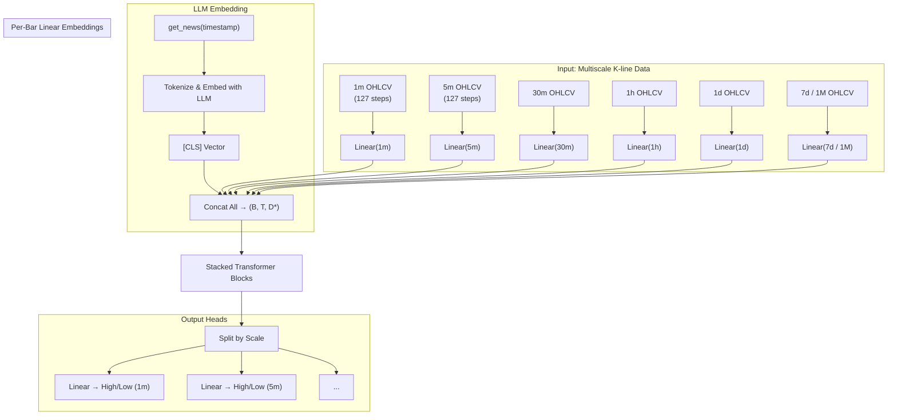

# MinerFormer: Multi-Timescale K-Line Forecasting Transformer

MinerFormer is a custom-designed Transformer model for financial forecasting based on multi-timescale candlestick (K-line) data. It predicts the next high and low prices using sequences from multiple resolutions (e.g., 1m, 5m, 1d, 1M), enhanced by optional semantic features from external large language models (LLMs).

<p align="center">
   
</p>

---

## 🔧 Features

- ⏱ Multi-resolution support: 1m, 5m, 30m, 1h, 1d, 7d, 1M...
- 🤖 LLM fusion support: Embed external news via `[CLS]` vectors
- 🧠 Predicts both `high` and `low` for each time window
- 🔁 Autopads historical sequences (front-padding) for early timestamps
- ✅ Fully modular forward logic for research/extension

---

## 📦 Contents

- `minerformer.py` — model architecture (embeddings, transformer blocks, output layers)
- `demo_train.py` — dummy example of how to run forward() on fake data
- `requirements.txt` — requirements for python libs

---

## 🚀 Usage

This repo only includes the model and demo training with random data. You'll need to:

1. Clone the repository:
   ```bash
   git clone https://github.com/TensorCraft/MinerFormer.git
   cd minerformer
   pip3 install -r requirements.txt
   python3 demo_train.py
   ```

## 🧠 MinerFormer Architecture



## 🎓 Research Context & Motivation
MinerFormer is designed to address the challenge of price extremum forecasting (highs and lows) across multiple temporal resolutions, a task fundamental to:

+ Quantitative trading

+ Multi-horizon portfolio hedging

+ Risk-aware position sizing

Unlike traditional models that operate on single-scale OHLC inputs, MinerFormer processes multi-resolution K-line sequences (e.g., 1m to 1M) in parallel, capturing short-term volatility and long-term trends simultaneously.

Furthermore, it optionally integrates semantic news signals (via frozen LLM [CLS] embeddings) to introduce latent macroeconomic and event-driven features into the price forecasting pipeline.

## 📚 Academic Positioning
This model draws inspiration from:

+ Temporal fusion transformers (TFT) for multi-scale time modeling

+ Multimodal Transformers for mixing numerical and semantic features

+ News-driven market modeling, as explored in NLP+Finance literature

Potential applications and research extensions include:

+ 🧠 Fine-tuning on market-specific asset classes (crypto, commodities, equities)

+ 📰 Exploring sentiment-conditioned K-line dynamics

+ 🪜 Multi-task learning (predict high/low + volatility/spread)

